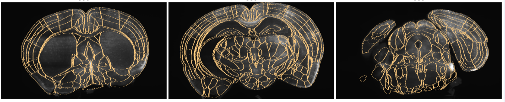
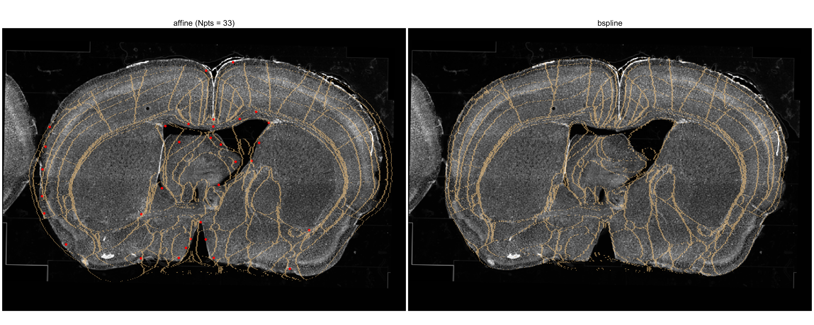

# LightSuite

**LightSuite** is a MATLAB-based software pipeline for the end-to-end analysis of whole-brain and spinal cord imaging data. Designed to seamlessly process 100GB+ datasets, it bridges the gap between raw experimental image stacks and quantitative, region-specific cell counts and intensities. 

LightSuite is specifically built to support three main types of data:
1. **Light-sheet volumes of the mouse brain**
2. **Light-sheet volumes of the mouse spinal cord**
3. **Wide-field coronal slices across the mouse brain**

---

## 🌟 Key Features

* **Three Distinct Modalities**: Dedicated workflows for 3D mouse brain volumes, 3D spinal cord volumes, and 2D coronal slice series.
* **Robust Anatomical Registration**: Align experimental image volumes to the standardized [Allen Common Coordinate Framework (CCF) v3](https://alleninstitute.github.io/abc_atlas_access/descriptions/Allen-CCF-2020.html) (2020) and the [Fiederling et al. (2021) spinal cord atlas](https://data.mendeley.com/datasets/4rrggzv5d5/1).
* **Automated 3D Cell Counting**: Detects cells by applying a size-based 3D band-pass filter, converting intensities to a signal-to-background ratio, and extracting local maxima to pinpoint cell locations.
* **Multi-Format Support**: Process multi-color TIFF volumes or single-color 2D TIFF series natively.

---

## ⚙️ Installation

Because LightSuite relies on several toolboxes and external executables, **please see our [Full Installation Guide](https://lightsuite.readthedocs.io/en/latest/)** for detailed step-by-step instructions. 

**Quick Requirements Summary:**
1. **MATLAB >= R2022b** (Requires Computer Vision, Image Processing, Optimization, Parallel Computing, and Statistics/Machine Learning Toolboxes).
2. **[Elastix 5.1.0](https://github.com/SuperElastix/elastix/releases/tag/5.1.0)** (Must be downloaded and added to your system `PATH`).
3. **MATLAB Dependencies**: [matlab_elastix](https://github.com/dimokaramanlis/matlab_elastix) and [yamlmatlab](https://github.com/raacampbell/yamlmatlab).
4. **Atlases**: The Allen CCF (2020) and/or the Fiederling Spinal Cord Atlas must be downloaded and added to your MATLAB path.

---

## 🚀 Getting Started

Depending on your microscopy data, LightSuite provides distinct entry points:

### 1. Light-sheet: Mouse Brain
For 3D light-sheet brain data, start with `ls_analyze_lightsheet_volume.m`. This script guides you through data loading, preprocessing, cell detection, and full brain registration.

### 2. Light-sheet: Spinal Cord
Spinal cord volumes utilize a similar volumetric workflow but register against the Fiederling et al. (2021) atlas to accommodate the specific geometry of the cord. *(See docs for specific script execution).*

### 3. Wide-field: Coronal Slices
For slices acquired through conventional wide-field microscopy, use `ls_analyze_slice_volume.m`. This pipeline includes registration, though manual adjustments are supported and recommended on a per-slice basis.

*For advanced configuration, parameter tuning (like average cell radius or signal thresholds), and detailed tutorials, please refer to the [LightSuite Documentation](https://lightsuite.readthedocs.io/en/latest/).*

---

## 🐛 Support and Issues

We welcome feedback, bug reports, and feature requests! 

* **Having trouble?** First, check the [Documentation](https://lightsuite.readthedocs.io/en/latest/).
* **Found a bug or have a request?** Please [open an issue](https://github.com/dimokaramanlis/LightSuite/issues) on GitHub. When reporting a bug, please include your OS, MATLAB version, and the exact error trace to help us resolve it faster.

---

## 📝 License and Citation

LightSuite is distributed under the **GPL-3.0 License**. See the `LICENSE` file for more details.

**Citation:** A preprint detailing LightSuite is currently in preparation. In the meantime, if you use this software in your research, please link back to this repository.
