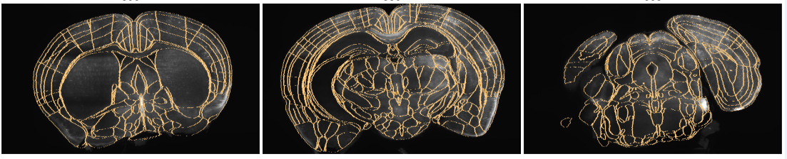
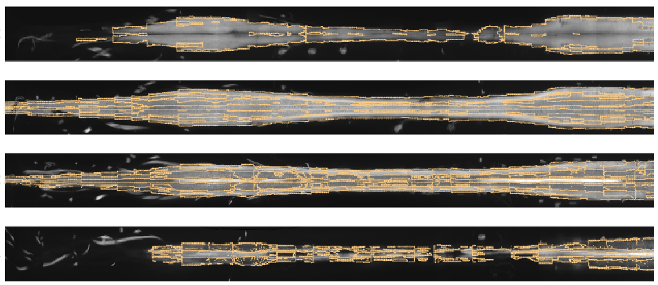
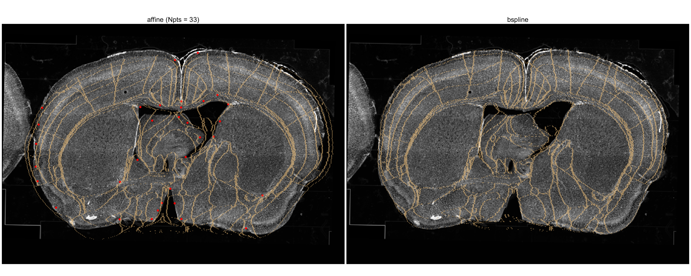

# LightSuite

**LightSuite** is an open-source MATLAB framework for **scalable atlas registration and cell detection across the central nervous system**. It processes 100 GB+ datasets on a standard workstation, turning raw image stacks into cell positions and regional intensities in standard atlas coordinates.

It combines **damage-resilient 3D point-cloud registration**, **user-steerable non-rigid registration**, and **GPU-accelerated local background normalization** for fast, illumination-invariant cell detection.

LightSuite supports four data types:
1. **Light-sheet volumes of the mouse brain**
2. **Light-sheet volumes of the mouse spinal cord**
3. **Wide-field coronal slices across the mouse brain**
4. **Functional ultrasound (fUS) volumes of the mouse brain**

---

## 🌟 Key Features

* **Damage-resilient registration**: Point clouds initialize the fit with Bayesian Coherent Point Drift, so tears, compression and missing structures become outliers rather than failures. Targets are the [Allen CCFv3](https://alleninstitute.github.io/abc_atlas_access/descriptions/Allen-CCF-2020.html) (Wang et al., 2020) and the [Fiederling et al. (2021) spinal cord atlas](https://data.mendeley.com/datasets/4rrggzv5d5/1).
* **User-steerable non-rigid fit**: An active-learning GUI re-fits the alignment live as you add landmark pairs, and those landmarks enter the Elastix B-spline objective directly alongside mutual information — image similarity alone cannot separate an anatomically faithful fit from a plausible but wrong one.
* **Fast whole-volume cell detection**: A 3D band-pass filter isolates cell-sized features, division by the local background gives an illumination-invariant signal-to-background ratio (SBR), and a lightweight CNN (98.7% validation accuracy) rejects bubble edges, tissue interfaces and neurite varicosities. ~4.5 × 10⁵ cells per brain in 3–4 h.
* **No dedicated autofluorescence channel needed**: Reporter fluorescence alone carries enough anatomical contrast to register, halving acquisition time and storage.
* **Standardized atlas-space outputs**: Cell positions, per-region counts, densities, soma diameters and intensities per hemisphere, plus atlas-aligned intensity volumes for every acquired channel.
* **Functional ultrasound**: Align repeated freehand-positioned sessions to a within-mouse seed, register that to a *vascular* CCFv3 template (vessels matched to vessels), and carry activation maps and timecourses into atlas space — optionally onto the Allen cortical flatmap.
* **Probe & implant tracing**: Localize Neuropixels tracks and cylindrical implants in atlas space, including the regions and fluorescence beneath an optical fiber or GRIN lens; probes export in the AP_histology-compatible `probe_ccf` format.

---

## ⚙️ Installation

Because LightSuite relies on several toolboxes and external executables, **please see our [installation guide](https://lightsuite.readthedocs.io/en/latest/installation/)** for detailed step-by-step instructions. 

**Quick Requirements Summary:**
1. **MATLAB >= R2022b** (Requires Computer Vision, Image Processing, Optimization, Parallel Computing, and Statistics/Machine Learning Toolboxes).
2. **[Elastix 5.1.0](https://github.com/SuperElastix/elastix/releases/tag/5.1.0)** (Must be downloaded and added to your system `PATH`).
3. **MATLAB Dependencies**: [matlab_elastix](https://github.com/dimokaramanlis/matlab_elastix) and [yamlmatlab](https://github.com/raacampbell/yamlmatlab).
4. **Atlases**: The Allen CCF (2020) and/or the Fiederling et al (2021) Spinal Cord Atlas must be downloaded and added to your MATLAB path.

---

## 🚀 Getting Started

Depending on your microscopy data, LightSuite provides distinct entry points:

### 1. Light-sheet: Mouse Brain
For 3D light-sheet brain data, start with `demos\ls_analyze_lightsheet_volume.m`. This script guides you through data loading, preprocessing, cell detection, and full brain registration.

### 2. Light-sheet: Spinal Cord
Spinal cord volumes utilize a similar volumetric workflow but register against the Fiederling et al (2021) atlas to accommodate the specific geometry of the cord. Start with `demos\ls_analyze_spinal_cord.m`.

### 3. Wide-field: Coronal Slices
For slices acquired through conventional wide-field microscopy, use `demos\ls_analyze_slice_volume.m`. This pipeline includes registration, though manual adjustments are supported and recommended on a per-slice basis.

### 4. Functional Ultrasound (fUS)
For repeated fUS scans of one mouse, start with `demos\ls_analyze_fusi.m`. The script builds a within-mouse anatomy by rigidly aligning every session to a user-picked seed, registers that anatomy to a vascular CCFv3 template (control-point GUI + multi-metric affine/B-spline fit), and brings functional maps and timeseries into atlas space, optionally onto the Allen cortical flatmap. See the [fUS workflow documentation](https://lightsuite.readthedocs.io/en/latest/usage_fusi/).

### 5. Probe & Implant Tracing (Light-sheet Brain)
Once a light-sheet brain has been registered (entry point 1), you can trace implanted hardware on the registered volume:
* **Neuropixels probes** — `demos\ls_trace_neuropixels.m` opens an annotation GUI (`annotateNeuropixelsProbes`) where you click points along each probe track, fits a straight line per probe in Allen CCF space, and exports `probe_ccf.mat` (points, insertion/tip coordinates, and the brain regions traversed) in the [AP_histology](https://github.com/petersaj/AP_histology) format.
* **GRIN lenses / optical fibers** — `annotateGRINLens` annotates circular fiber cross-sections and reports the atlas regions under the lens at a range of depths.

*For advanced configuration, parameter tuning (like average cell radius or signal thresholds), GUI instructions, and detailed tutorials, please refer to the [LightSuite Documentation](https://lightsuite.readthedocs.io/en/latest/).*

---

## 🐛 Support and Issues

We welcome feedback, bug reports, and feature requests! 

* **Having trouble?** First, check the [Documentation](https://lightsuite.readthedocs.io/en/latest/).
* **Found a bug or have a request?** Please [open an issue](https://github.com/dimokaramanlis/LightSuite/issues) on GitHub. When reporting a bug, please include your OS, MATLAB version, and the exact error trace to help us resolve it faster.

---

## 📝 License and Citation

LightSuite is distributed under the **GPL-3.0 License**. See the `LICENSE` file for more details.

**Citation:** Karamanlis D, Xie Y, Foucher CG, Alappat M, Masood A, Dimitropoulou I, Pivron LAF, Martínez de Paz JM, Macé E, Gaspari S, El-Boustani S. *LightSuite: scalable atlas registration and cell detection across the central nervous system* (in preparation). Until it appears, please link back to this repository.